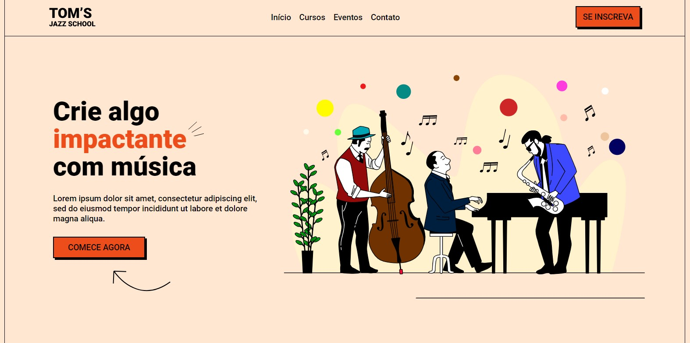

# Tom's Jazz School

Tom's Jazz School é uma landing page desenvolvida para promover uma escola de jazz. A página inclui informações sobre a escola e suas atividades, com um design visualmente atraente.

## Tecnologias Utilizadas:
- HTML
- CSS
- JavaScript




## Como Executar o Projeto (caso queiram)
1. Clone este repositório:
   ```sh
   git clone https://github.com/SrtaKennedy/Tom-s-Jazz-School.git
   ```
2. Navegue até o diretório do projeto:
   ```sh
   cd Tom-s-Jazz-School
   ```
3. Abra o arquivo `index.html` no seu navegador.